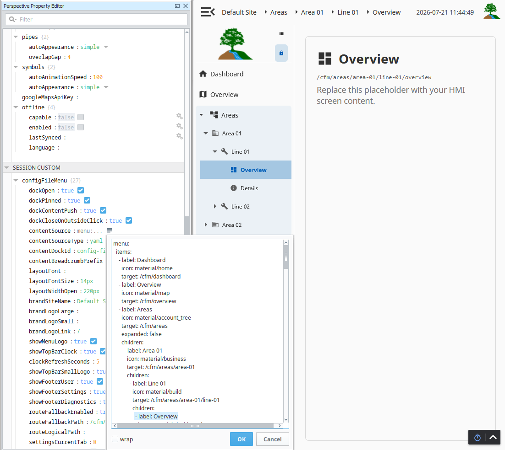
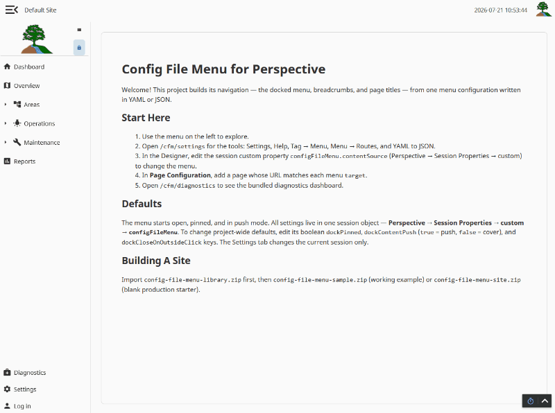
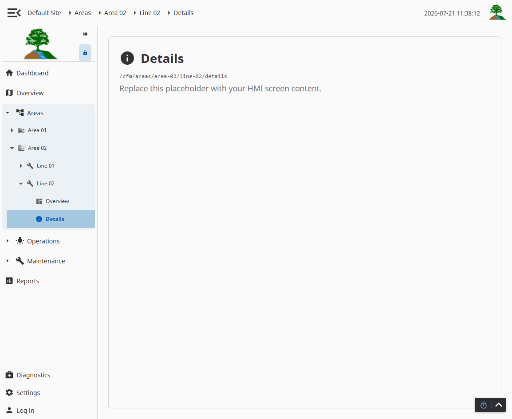
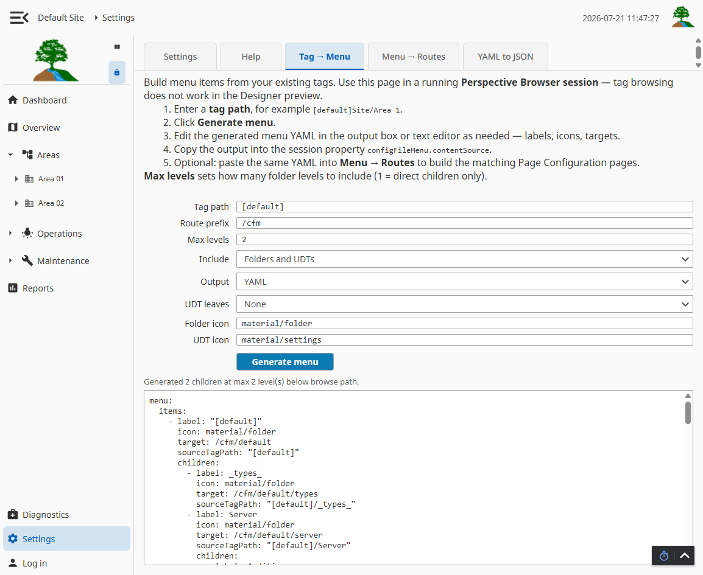
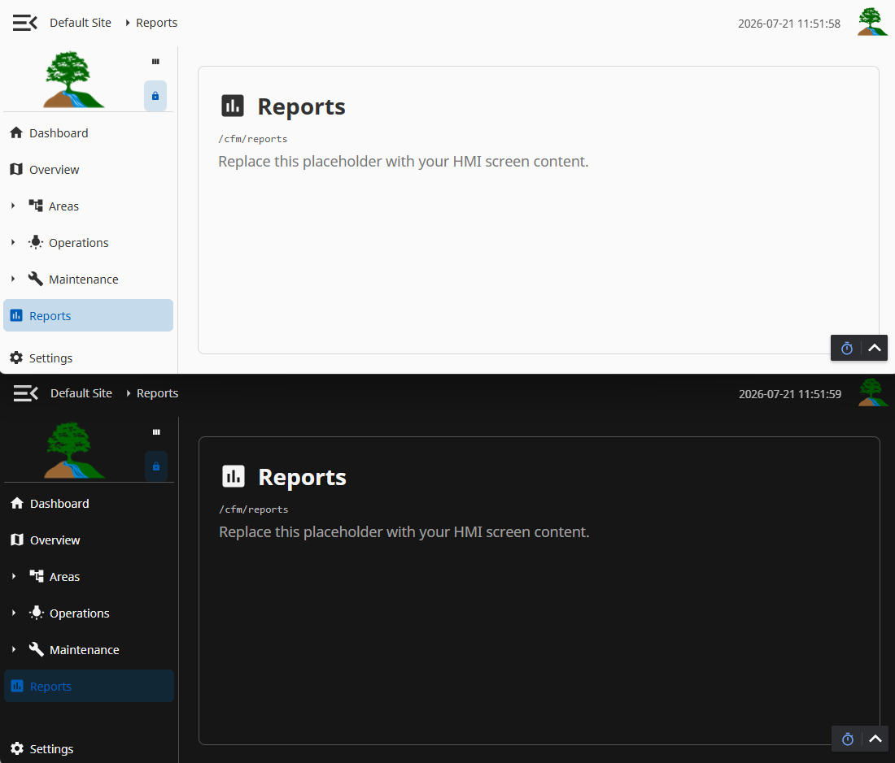

# Config File Menu

**Generate your entire Perspective navigation from one configuration file — YAML or JSON drives nested menus, icons, breadcrumbs, and page titles that stay in sync on every publish.**

[](Config_File_Menu/LICENSE)
[](https://github.com/EdenOaksConsulting/Ignition-Config-File-Menu-for-Perspective/releases/latest)

**Author:** EdenOaks Consulting  
**Maintainer:** Matt McPheeters



*One session property, `configFileMenu.contentSource`, drives the docked menu, the top-bar
breadcrumbs, and the page title.*

---

## What it does

Config File Menu turns your Perspective navigation into **data you can generate and maintain outside Designer**. Define labels, icons, routes, nested sections, and optional role visibility once in `menuConfig`; the docked side menu, top-bar breadcrumbs, and sample page titles are built from that same definition at runtime.

**Advantages of configuration-file menu generation:**

- **Single source of truth** — One parameter drives the dock, breadcrumbs, and titles; no per-link embeds to keep aligned.
- **Fast iteration** — Add sites, reorder sections, or change icons by editing text, then publish.
- **Version-control friendly** — Store menu structure in git alongside your project, or generate it from templates and scripts.
- **Portable authoring** — Start from sample YAML/JSON, convert between formats in Settings, or produce config from external tooling.
- **No runtime dependencies** — No database, custom modules, or Python libraries required.

## Highlights

| Capability | Detail |
|---|---|
| **Config-driven menu** | Edit `MenuContent.params.menuConfig` — YAML-lite or JSON |
| **Deep nesting** | Multi-level `children` with icons at every level |
| **Smart breadcrumbs** | Top bar resolves paths from the same menu config |
| **Responsive docks** | Push/cover modes, pin, hamburger open/close |
| **Settings hub** | In-session preferences, YAML→JSON converter, built-in help |
| **Host integration** | Advanced Stylesheet ships with library import (Ignition 8.3+) |
| **Site + sample packages** | Site zip for production; sample zip for evaluation |

## Quick start

1. Download **`config-file-menu-library.zip`** plus one child zip from the [latest release](https://github.com/EdenOaksConsulting/Ignition-Config-File-Menu-for-Perspective/releases/latest).
2. Import **`config-file-menu-library.zip`** first.
3. Choose a child:
   - Import **`config-file-menu-sample.zip`** to learn with a working reference project.
   - Import **`config-file-menu-site.zip`** to start a blank production site.
4. Set Session Properties **theme** to **`light`** or **`dark`**.
5. For the sample, launch **`/cfm/dashboard`**.

For zip-first customization, see **[DEPLOYMENT.md](Config_File_Menu/DEPLOYMENT.md)**.

Full installation, host-project merge steps, and troubleshooting:
**[Config_File_Menu/README.md](Config_File_Menu/README.md)**

## Menu configuration example

```yaml
menu:
  items:
    - label: Dashboard
      icon: material/home
      target: /cfm/dashboard

    - label: Areas
      icon: material/account_tree
      target: /cfm/areas
      children:
        - label: Area 01
          icon: material/location_city
          target: /cfm/areas/area-01
          children:
            - label: Line 01
              icon: material/precision_manufacturing
              target: /cfm/areas/area-01/line-01
```

Set `params.menuConfigType` to `yaml` or `json`. Every `target` needs a matching route in `page-config/config.json`. Samples:
[`menuSampleConfig.yaml`](Config_File_Menu/config/menuSampleConfig.yaml) · [`menuSampleConfig.json`](Config_File_Menu/config/menuSampleConfig.json)

> **Security note:** Menu visibility by role is a convenience only. Always enforce access control on destination Perspective pages, views, or actions.

## Screenshots

**Dock behavior** — hamburger open/close, expanding a nested section, breadcrumbs updating
on navigation, pin, push/cover, and click-outside close.



**Nested menu and breadcrumbs** — multi-level tree with icons at every level; the top-bar
trail and page title resolve from the same config.



**Tag → Menu generator** — browse a tag path and generate a menu branch to paste into
`contentSource`, one of five Settings tabs.



**Light and dark** — the same page under both session themes.



## Requirements

| | |
|---|---|
| **Ignition** | 8.3.0+ (Perspective 3.3+) |
| **Modules** | Perspective |
| **Database / tags** | None |
| **Maker Edition** | Compatible where Perspective is available |

## Integration paths

**Evaluate the sample** — Import library + sample, set theme to `light`, explore reference routes and Diagnostics.

**Deploy a site** — Import library + site zip; customize in the zip before import ([DEPLOYMENT.md](Config_File_Menu/DEPLOYMENT.md)).

**Add to an existing project** — Import views, merge shared docks and page routes, confirm Advanced Stylesheet is enabled, set Session Properties **theme** to light/dark or your custom gateway theme, configure `MenuContent.params.menuConfig`.

See **[DESIGNER_IMPORT_CHECKLIST.md](Config_File_Menu/DESIGNER_IMPORT_CHECKLIST.md)** before publishing to production.

## Repository layout

| Path | Purpose |
|---|---|
| [`Config_File_Menu/`](Config_File_Menu/) | Perspective project source (library manifest in working tree) |
| [`dist/`](dist/) | Local build output — zips are built here, then published to Releases |

Import zips are attached to each [release](https://github.com/EdenOaksConsulting/Ignition-Config-File-Menu-for-Perspective/releases/latest), not committed to the repository:

| Release asset | Purpose |
|---|---|
| `config-file-menu-library.zip` | Inheritable library import (views, docks, Advanced Stylesheet) — import first |
| `config-file-menu-site.zip` | Site deployment child (empty menu, editable logos) |
| `config-file-menu-sample.zip` | Sample child (reference routes + menuConfig) |

To build them yourself: `python Config_File_Menu/scripts/build-inheritance-zips.py`

## License & attribution

Config File Menu is original work by **EdenOaks Consulting**, maintained by **Matt McPheeters**, and licensed under **[MIT](Config_File_Menu/LICENSE)**.

Inspired by [Artek Responsive Navigation](https://inductiveautomation.com/exchange/2463) (concept only; no Artek source included). Includes an adapted [Diagnostics Dashboard](https://inductiveautomation.com/exchange/98/overview) by Travis Cox. Details: **[ATTRIBUTION.md](Config_File_Menu/ATTRIBUTION.md)**.

## Documentation index

| Document | Contents |
|---|---|
| [Deployment](Config_File_Menu/DEPLOYMENT.md) | Zip-first site deployment, logos, Settings tools |
| [Overview](Config_File_Menu/OVERVIEW.md) | Short introduction for Exchange downloaders |
| [Technical README](Config_File_Menu/README.md) | Configuration, docks, theming, troubleshooting |
| [Import checklist](Config_File_Menu/DESIGNER_IMPORT_CHECKLIST.md) | Pre-publish verification |
| [Changelog](Config_File_Menu/CHANGELOG.md) | Release history |
